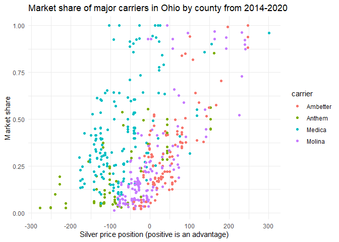
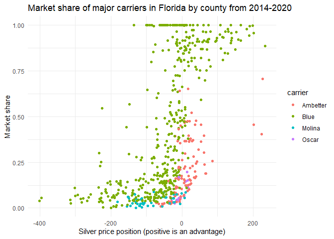
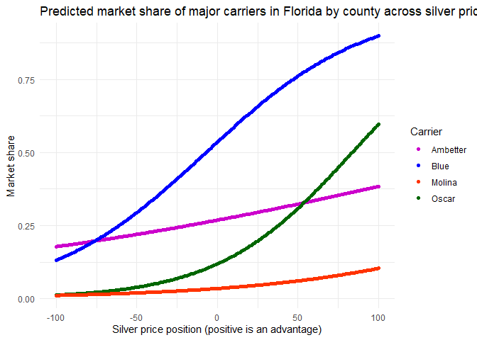
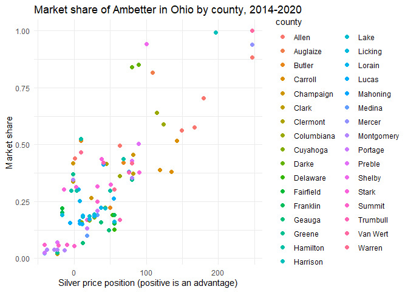

ACA Market Share Modeling
================
Aaron Olcerst, Ph.D.
2022-11-10

## Scope

The purpose of this project is to create a model that uses pricing data
to explain variations in market share among Affordable Care Act (ACA)
marketplace health insurance carriers.

Organization

The script is organized into modules. Each stage of data prep has its
own module, and then there’s an additional module (data_prep) that
combines the prior stages. Modeling and visualization are given their
own modules as well. Finally, there’s a “main script” that calls all the
modules, a function which is also performed by this RMarkdown.

###### If you’re not interested in an explanation of the background and process, feel free to scroll down to see the results.

## Background

The ACA marketplace is a highly competitive environment. Each year,
carriers spend months developing prices and tweaking plan design for the
upcoming year. They’ll look to expand their service area, if they can
sign network contracts in time, or perhaps pull out of a volatile market
where they are priced inadequately and cannot recover. Generally, prices
are developed with little information about how other carriers plan to
price. Later in the process, tidbits of information get released
(depending on the state) leading up to the full release of information
shortly before open enrollment begins, usually on November 1st. By then
it’s usually way too late to make changes.

Once open enrollment begins, carriers cross their fingers that their
current members stick with them and hope that they attract enough new
enrollees to hit their financial projections. Because each year is
something of a fresh start, membership can change dramatically year over
year. Once open enrollment has ended, however, enrollment is largely
stable, with some members’ coverage lapsing each month and more joining
because of a qualifying life event. Discussion of those small monthly
changes are outside of the scope of this project, which focuses on
large-scale membership changes at open enrollment.

These models can be used to predict future market share of a carrier
given expected pricing data for all carriers in a market, of course, but
there are other interesting applications as well. Each carrier’s brand
strength, value prop, and network (among other variables, all of which
are difficult to explicitly represent in a model) contribute to
differences in price elasticity, i.e. how quickly market share changes
with prices, and we can get a better sense of that metric once we build
the model. Lastly, we can also inform strategic decisions regarding
markets worth targeting for membership with investment in the form of
price decreases, and where we might be able to shore up risk with price
increases without losing too many members.

## Data

This project uses publicly available data from CMS. Most state’s
marketplaces are handled through the federal exchange, Healthcare.gov,
but several states have opted to create their own marketplaces. These
are known as state-based exchanges (SBEs). SBE’s data is usually not
included in data released from CMS. It’s usually out there somewhere,
but it’s hard to find and isn’t included in this exercise for that
reason.

Pricing data for the upcoming plan year is released shortly before each
open enrollment period, usually in October. Pricing data is highly
granular, and is represented at the carrier x county x plan level. When
you actually choose an insurance plan on the exchange, the price usually
increases or decreases based on your age and whether you’re a smoker.
Because we’re looking at market-level effects, we’re going to stick with
the standardized rates for a 40 year old, which is already included in
the data. Source of data:
<https://www.healthcare.gov/health-and-dental-plan-datasets-for-researchers-and-issuers/>

Unfortunately, carrier-level enrollment data is not nearly as granular
in the public data releases. Although it would be fun and enlightening
to have plan-level enrollment for each carrier, all we get is total
enrollment at the end of open enrollment by carrier by county. We don’t
know what plans people choose, and we don’t know how many of those
enrollees are renewing their coverage with that carrier from the prior
year as opposed to choosing their coverage anew. Source of data:
<https://www.cms.gov/CCIIO/Resources/Data-Resources/issuer-level-enrollment-data>

## Approach

Our response variable will be each carrier’s total market share in each
county, because that’s as granular as we can get with public data.

Because of the limited enrollment data, we’re going to have to aggregate
pricing data. Plans are categorized into five tiers - catastrophic,
bronze, silver, gold, and platinum. Carriers are usually only required
to offer silver plans, which are middle-of-the-road plans that offer
both premium subsidies and cost sharing subsidies for low-income
members. Because of these subsidies, enrollment is heavily concentrated
into low-cost silver plans at the national level, although some counties
have larger bronze markets.

We’re therefore going to use the lowest bronze and silver price for each
carrier in each county to calculate price positions. We can also use a
carrier by state dummy variable to allow our model to capture the
intangibles like brand and network, which will allow us more clearly
demonstrate the differences in price elasticity for each carrier.

Now that we have our variables chosen, it’s important to realize that
this will need to be a non-linear model. The reason for this is pretty
simple. If a carrier’s prices are neck-and-neck with a competitor’s
prices, then each dollar improvement is likely to have a meaningful
impact on market share. On the other hand, if a carrier is already far
cheaper than all competitors, then changing the price by a few dollars
won’t have much of an impact. The demand curve, then, is going to be
sigmoid and can be represented by a logistic model.

For this exercise, we’re going to use a simple logistic GLM. Our
response variable will be market share at the carrier x county x year
level. We’ll use bronze and silver price positions, each interacted with
our carrier-state dummy variable, as our independent variables.

## Prep market enrollment

Here we’re collecting data describing the number of people enrolled
across all carriers in each county for each year. This will serve as the
denominator for our market share calculations

``` r
source("enrollment_munging.R")
mkt <- enrollment_munging()
head(mkt)
```

    ## # A tibble: 6 x 4
    ##    year state fips  mkt_total
    ##   <dbl> <chr> <chr>     <dbl>
    ## 1  2015 AL    01001      1736
    ## 2  2015 AL    01003      9684
    ## 3  2015 AL    01005       805
    ## 4  2015 AL    01007       557
    ## 5  2015 AL    01009      1832
    ## 6  2015 AL    01011       292

## Prep carrier-level enrollment

This section collects carrier-specific enrollment for each county from
2014-2020. This will serve as our numerator for the market share
calculations.

``` r
source("signup_munging.R")
signups <- signup_munging()
head(signups)
```

    ## # A tibble: 6 x 5
    ##    year state fips   hios signups
    ##   <dbl> <chr> <chr> <dbl>   <dbl>
    ## 1  2015 AK    02013 38344      28
    ## 2  2015 AK    02016 38344      32
    ## 3  2015 AK    02020 38344    7806
    ## 4  2015 AK    02050 38344      47
    ## 5  2015 AK    02060 38344      24
    ## 6  2015 AK    02068 38344     129

## Prep price position data

Next we need pricing data. Because the enrollment data is so course,
we’ll need to aggregate to relative price positions for each carrier’s
metal tier at the county level for each year in the data set.

``` r
source("price_munging.R")
prices <- price_munging()
head(prices)
```

    ## # A tibble: 6 x 22
    ## # Groups:   year, state, rating_area, fips, county, issuer, hios [6]
    ##    year state rating_area   fips  county  issuer hios  price_Silver price_Bronze
    ##   <dbl> <chr> <chr>         <chr> <chr>   <chr>  <chr>        <dbl>        <dbl>
    ## 1  2022 AK    Rating Area 1 02020 Anchor~ Preme~ 38344         716.         472.
    ## 2  2022 AK    Rating Area 1 02020 Anchor~ Moda ~ 77963         653          416 
    ## 3  2022 AK    Rating Area 2 02090 Fairba~ Preme~ 38344         723.         476.
    ## 4  2022 AK    Rating Area 2 02090 Fairba~ Moda ~ 77963         686          437 
    ## 5  2022 AK    Rating Area 3 02100 Haines  Preme~ 38344         688.         453.
    ## 6  2022 AK    Rating Area 3 02100 Haines  Moda ~ 77963         670          427 
    ## # ... with 13 more variables: price_Gold <dbl>, price_Catastrophic <dbl>,
    ## #   price_Platinum <dbl>, price_pos_Silver <dbl>, price_pos_Bronze <dbl>,
    ## #   price_pos_Gold <dbl>, price_pos_Catastrophic <dbl>,
    ## #   price_pos_Platinum <dbl>, ranks_Silver <int>, ranks_Bronze <int>,
    ## #   ranks_Gold <int>, ranks_Catastrophic <int>, ranks_Platinum <int>

## Combine data sets and prep for modeling

We’re almost there! Just need to combine all the data we’ve created so
far.

``` r
source("data_prep.R")
data <- data_prep()
head(data)
```

    ## # A tibble: 6 x 28
    ## # Groups:   car_state [2]
    ##    year state rating_area   fips  county          carrier car_state issuer hios 
    ##   <dbl> <chr> <chr>         <chr> <chr>           <chr>   <fct>     <chr>  <chr>
    ## 1  2020 AK    Rating Area 1 02020 Anchorage       Blue    Blue_AK   Preme~ 38344
    ## 2  2020 AK    Rating Area 1 02020 Anchorage       Moda    Moda_AK   Moda ~ 77963
    ## 3  2020 AK    Rating Area 2 02122 Kenai Peninsula Blue    Blue_AK   Preme~ 38344
    ## 4  2020 AK    Rating Area 2 02122 Kenai Peninsula Moda    Moda_AK   Moda ~ 77963
    ## 5  2020 AK    Rating Area 2 02170 Matanuska Susi~ Blue    Blue_AK   Preme~ 38344
    ## 6  2020 AK    Rating Area 2 02170 Matanuska Susi~ Moda    Moda_AK   Moda ~ 77963
    ## # ... with 19 more variables: price_Silver <dbl>, price_Bronze <dbl>,
    ## #   price_Gold <dbl>, price_Catastrophic <dbl>, price_Platinum <dbl>,
    ## #   price_pos_Silver <dbl>, price_pos_Bronze <dbl>, price_pos_Gold <dbl>,
    ## #   price_pos_Catastrophic <dbl>, price_pos_Platinum <dbl>, ranks_Silver <int>,
    ## #   ranks_Bronze <int>, ranks_Gold <int>, ranks_Catastrophic <int>,
    ## #   ranks_Platinum <int>, mkt_total <dbl>, signups <dbl>, carrier_tot <dbl>,
    ## #   mkt_share <dbl>

## EDA

Now that we have the data prepped, let’s look at some visuals. Checking
out data from Ohio, we can see that market shares tend to cluster along
different silver price position slopes for each carrier.

``` r
source("visualization.R")
plot_OH_state()
```

<!-- -->

In Florida, it’s easy to see that the Blues can sustain higher
membership with a less competitive price position.

``` r
plot_FL_state()
```

<!-- --> \## Build a
model

This next step builds a logistic GLM using silver price position, bronze
price position, and carrier x state dummy variables.

``` r
source("model_build.R")
```

    ## 
    ## Attaching package: 'caret'

    ## The following object is masked from 'package:purrr':
    ## 
    ##     lift

``` r
glm.mod <- build_model()
```

## What can we learn from the model?

We can now build illustrative plots that show, when controlling for
price position, the implicit differences in the competitiveness of each
carrier. As one can clearly see in the graph below, the Blues have an
large implicit advantage over other carriers when price is held
constant. We can’t explicitly identify why that is using our model, but
we can guess that brand recognition, network, and advertising play a
large role.

``` r
viz_dat <- prep_lines()
plot_illustrative()
```

<!-- -->

However, it’s worth noting that this model isn’t great in its current
state. If we look at county-level plots of a single carrier, Ambetter,
it’s obvious that there is a lot of county-level variation that this
model can’t account for.

``` r
plot_OH_amb()
```

<!-- -->

``` r
plot_OH_amb()
```

<!-- --> 

## Final thoughts

The best way to deal with this is to build a model that incorporates
county-level variation without over-fitting. This could be through a
non-linear mixed-effect model, or a carefully constructed tree-based
model.

Ultimately, however, much better models can be constructed with
first-party data, which not only allows for metal-tier-level
projections, but also delineation into separate models which project
retention of existing members and acquisition of new members.
