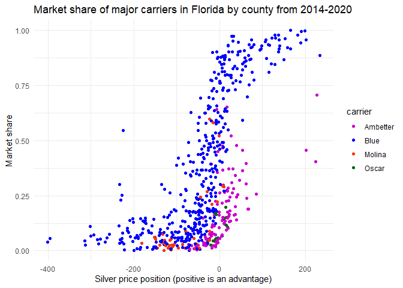

ACA Market Share Modeling
================
Aaron Olcerst, Ph.D.
2022-11-10

## Scope

The purpose of this project is to create a model that uses pricing data
to predict market share among Affordable Care Act (ACA) marketplace
health insurance carriers.

## Organization

The script is organized into modules. Each stage of data prep has its
own module, and then there’s an additional module (data_prep) that
combines the prior stages. Modeling and visualization are given their
own modules as well. Finally, there’s a “main script” that calls all the
modules, a function which is also integrated into this RMarkdown.

## Background

The ACA marketplace is a highly competitive environment. Each year,
carriers spend months developing prices and tweaking plan design for the
upcoming year. They’ll look to expand their service area if they can
negotiate and sign network contracts in time, or perhaps pull out of a
volatile market where they are priced inadequately and cannot recover.
Generally, prices are developed with little information about how other
carriers plan to price. As the process continues, tidbits of information
may get released (depending on the state), and carriers might scramble
to adjust their prices to better position their product. The full
release of pricing data comes shortly before open enrollment begins,
usually on November 1st. By then it’s usually way too late to make
changes.

Once open enrollment begins, carriers cross their fingers that their
current members stick with them and hope that they attract enough new
enrollees to hit their financial projections. Because each year is
something of a fresh start, membership can change dramatically year over
year. Once open enrollment has ended, however, enrollment is largely
stable, with some members’ coverage lapsing each month and more joining
because of a qualifying life event. Discussion of those small monthly
changes are outside of the scope of this project, which focuses on
large-scale membership changes at open enrollment.

These models can be used to predict future market share of a carrier
given expected pricing data for all carriers in a market, of course, but
there are other interesting applications as well. Although we can
surmise that brand strength, value prop, and network all have an
important impact on enrollment, it is difficult to explicitly
incorporate these variables into a model given the lack of available
data. We can build them into the model in an implicit manner, however,
and we can then measure and compare carriers’ command of market share
that is attributable to factors other than price. More tangibly, we can
also use these models to inform strategic decisions regarding markets
worth targeting for membership with investment in the form of price
decreases, and where we might be able to shore up risk with price
increases without losing too many members.

## Data

This project uses publicly available data from the Centers for Medicare
and Medicaid Services (CMS). Most state’s marketplaces are handled
through the federal exchange, Healthcare.gov, but several states have
opted to create their own marketplaces. These are known as state-based
exchanges (SBEs). SBE data is not typically included in data released
from CMS. It’s usually out there somewhere, but it can be hard to find
and isn’t included in this exercise for that reason.

Pricing data for the upcoming plan year is released shortly before each
open enrollment period, usually in October. Pricing data is highly
granular, and is represented at the carrier x county x plan level. When
you actually choose an insurance plan on the exchange, the price usually
increases or decreases based on your age and whether you’re a smoker.
Because we’re looking at market-level processes, we’re going to stick
with the standardized rates for a 40 year old, which is already included
in the data. Source of data:
<https://www.healthcare.gov/health-and-dental-plan-datasets-for-researchers-and-issuers/>

Unfortunately, carrier-level enrollment data is not nearly as granular
in the public data releases. Although it would be fun and enlightening
to have plan-level enrollment for each carrier, all we get is total
enrollment at the end of open enrollment by carrier by county. We don’t
know what plans people choose, and we don’t know how many of those
enrollees are renewing their coverage with that carrier from the prior
year as opposed to choosing their coverage anew. Source of data:
<https://www.cms.gov/CCIIO/Resources/Data-Resources/issuer-level-enrollment-data>

## Approach

Our response variable, i.e. the thing we’re going to predict, will be
each carrier’s total market share in each county, because that’s as
granular as we can get with public data.

Because of the limited enrollment data, we’re going to have to aggregate
pricing data. Plans are categorized into five tiers - catastrophic,
bronze, silver, gold, and platinum. Carriers are usually only required
to offer silver plans, which are middle-of-the-road plans that offer
both premium subsidies and cost sharing subsidies for low-income
members. Because of these subsidies, enrollment is heavily concentrated
into low-cost silver plans at the national level, although some counties
have larger bronze markets.

We’re therefore going to use the lowest silver price for each carrier in
each county to calculate price positions. We can also use a carrier by
state dummy variable to allow our model to capture the intangibles like
brand and network, which will allow us more clearly demonstrate the
differences in price elasticity for each carrier.

Now that we have our variables chosen, it’s important to realize that
this will need to be a non-linear model. The reason for this is pretty
simple. If a carrier’s prices are neck-and-neck with a competitor’s
prices, then each dollar improvement is likely to have a meaningful
impact on market share. On the other hand, if a carrier is already far
cheaper than all competitors, then changing the price by a few dollars
won’t have much of an impact. The demand curve, then, is going to be
sigmoid and can be represented by a logistic model.

For this exercise, we’re going to use a simple logistic GLM. Our
response variable will be market share at the carrier x county x year
level. We’ll use silver price positions interacted with our
carrier-state dummy variable as our independent variables. This
configuration allows the model to assign different price elasticities to
each carrier in each state.

## Prep market enrollment

Here we’re collecting data describing the number of people enrolled
across all carriers in each county for each year. This will serve as the
denominator for our market share calculations

``` r
source("enrollment_munging.R")
mkt <- enrollment_munging()
head(mkt)
```

    ## # A tibble: 6 x 4
    ##    year state fips  mkt_total
    ##   <dbl> <chr> <chr>     <dbl>
    ## 1  2015 AL    01001      1736
    ## 2  2015 AL    01003      9684
    ## 3  2015 AL    01005       805
    ## 4  2015 AL    01007       557
    ## 5  2015 AL    01009      1832
    ## 6  2015 AL    01011       292

## Prep carrier-level enrollment

This section collects carrier-specific enrollment for each county from
2014-2020. This will serve as our numerator for the market share
calculations.

``` r
source("signup_munging.R")
signups <- signup_munging()
head(signups)
```

    ## # A tibble: 6 x 5
    ##    year state fips   hios signups
    ##   <dbl> <chr> <chr> <dbl>   <dbl>
    ## 1  2015 AK    02013 38344       0
    ## 2  2015 AK    02016 38344      11
    ## 3  2015 AK    02020 38344    1927
    ## 4  2015 AK    02050 38344      12
    ## 5  2015 AK    02060 38344      20
    ## 6  2015 AK    02068 38344      61

## Prep price position data

Next we need pricing data. Because the enrollment data is so coarse,
we’ll need to aggregate to relative price positions for each carrier’s
metal tier at the county level for each year in the data set.

``` r
source("price_munging.R")
prices <- price_munging()
```

    ## Joining, by = c("State Code", "County Name")
    ## Joining, by = c("year", "state", "rating_area", "fips", "county", "metal")
    ## Joining, by = c("year", "state", "rating_area", "fips", "county", "metal")

``` r
head(prices)
```

    ## # A tibble: 6 x 22
    ## # Groups:   year, state, rating_area, fips, county, issuer, hios [6]
    ##    year state rating_area   fips  county    issuer hios  price_Gold price_Silver
    ##   <dbl> <chr> <chr>         <chr> <chr>     <chr>  <chr>      <dbl>        <dbl>
    ## 1  2020 AK    Rating Area 1 02020 Anchorage Preme~ 38344        642          702
    ## 2  2020 AK    Rating Area 1 02020 Anchorage Moda ~ 77963        621          683
    ## 3  2020 AK    Rating Area 2 02122 Kenai Pe~ Preme~ 38344        674          738
    ## 4  2020 AK    Rating Area 2 02122 Kenai Pe~ Moda ~ 77963        621          683
    ## 5  2020 AK    Rating Area 2 02170 Matanusk~ Preme~ 38344        674          738
    ## 6  2020 AK    Rating Area 2 02170 Matanusk~ Moda ~ 77963        621          683
    ## # ... with 13 more variables: price_Bronze <dbl>, price_Catastrophic <dbl>,
    ## #   price_Platinum <dbl>, price_pos_Gold <dbl>, price_pos_Silver <dbl>,
    ## #   price_pos_Bronze <dbl>, price_pos_Catastrophic <dbl>,
    ## #   price_pos_Platinum <dbl>, ranks_Gold <int>, ranks_Silver <int>,
    ## #   ranks_Bronze <int>, ranks_Catastrophic <int>, ranks_Platinum <int>

## Combine data sets and prep for modeling

We’re almost there! Just need to combine all the data we’ve created so
far, and do a little bit of feature engineering to prepare for building
the model.

``` r
source("data_prep.R")
data <- data_prep()
head(data)
```

    ## # A tibble: 6 x 28
    ## # Groups:   car_state [2]
    ##    year state rating_area fips  county carrier car_state issuer hios  price_Gold
    ##   <dbl> <chr> <chr>       <chr> <chr>  <chr>   <fct>     <chr>  <chr>      <dbl>
    ## 1  2020 AK    Rating Are~ 02020 Ancho~ Blue    Blue_AK   Preme~ 38344        642
    ## 2  2020 AK    Rating Are~ 02020 Ancho~ Moda    Moda_AK   Moda ~ 77963        621
    ## 3  2020 AK    Rating Are~ 02122 Kenai~ Blue    Blue_AK   Preme~ 38344        674
    ## 4  2020 AK    Rating Are~ 02122 Kenai~ Moda    Moda_AK   Moda ~ 77963        621
    ## 5  2020 AK    Rating Are~ 02170 Matan~ Blue    Blue_AK   Preme~ 38344        674
    ## 6  2020 AK    Rating Are~ 02170 Matan~ Moda    Moda_AK   Moda ~ 77963        621
    ## # ... with 18 more variables: price_Silver <dbl>, price_Bronze <dbl>,
    ## #   price_Catastrophic <dbl>, price_Platinum <dbl>, price_pos_Gold <dbl>,
    ## #   price_pos_Silver <dbl>, price_pos_Bronze <dbl>,
    ## #   price_pos_Catastrophic <dbl>, price_pos_Platinum <dbl>, ranks_Gold <int>,
    ## #   ranks_Silver <int>, ranks_Bronze <int>, ranks_Catastrophic <int>,
    ## #   ranks_Platinum <int>, mkt_total <dbl>, signups <dbl>, carrier_tot <dbl>,
    ## #   mkt_share <dbl>

## EDA

Now that we have the data prepped, let’s create some visuals. Checking
out data from Ohio, we can see that market shares tend to cluster along
different silver price position intercepts for each carrier. In other
words, the slopes for each carrier seem reasonably similar, but they are
shifted left and right for different carriers.

``` r
source("visualization.R")
plot_OH_state()
```

<!-- -->

In Florida, it’s easy to see that the Blues can sustain higher
membership with a less competitive price position. In other words, at a
price advantage of zero, their market shares tend to be higher on the
vertical axis than other carriers’ market shares.

``` r
plot_FL_state()
```

<!-- -->

## Build a model

This next step builds a logistic GLM using silver price position and
carrier-state dummy variables.

``` r
source("model_build.R")
glm.mod <- build_model()
```

You can see the formula below. For what we’re doing, it’s a very simple
model.

``` r
glm.mod$call
```

    ## glm(formula = mkt_share ~ price_pos_Silver * car_state, family = binomial, 
    ##     data = mod_data)

## What can we learn from the model?

We can now build illustrative plots that show, after controlling for
price position, the implicit differences in the competitiveness of each
carrier. As one can clearly see in the graph below, the Blues have an
large implicit advantage over other carriers in Florida when price is
held constant. We can’t explicitly identify why that is using our model,
but we can guess that brand recognition and network play a large role.

``` r
viz_dat <- prep_lines()
plot_illustrative()
```

<!-- -->

Looking at the table below, we can see the predicted market share of
four major carriers when they are at a \$10 advantage. The Blues show a
commanding lead at 58% market share, while the next carrier, Molina,
only draws 38% share.

``` r
table_illustrative()
```

| State   | Carrier  | Silver Price Position | Predicted Share |
|:--------|:---------|----------------------:|:----------------|
| Florida | Ambetter |                    10 | 17%             |
| Florida | Blue     |                    10 | 58%             |
| Florida | Oscar    |                    10 | 12%             |
| Florida | Molina   |                    10 | 38%             |

However, it’s worth noting that this model isn’t great in its current
state. If we look at county-level plots of a single carrier, Ambetter,
it’s obvious that there is a lot of county-level variation that this
model can’t account for in its current state.

``` r
plot_OH_amb()
```

<!-- -->

``` r
plot_TX_amb()
```

<!-- -->

## Final thoughts

In this script, we created a basic model that can be used to project
market share given the pricing of carriers in a market. Generally, this
type of model can be used to future membership, analyze relative
competitive strengths of carriers, optimize pricing, and assess the
viability of new product offerings.

As noted, this model could still use some work. The best way to deal
with the lack of county specificity is to build a model that
incorporates county-level variation without over-fitting. This could be
through a a carefully constructed tree-based model or a non-linear
mixed-effects (NLME) model, among many other options. NLME models are
great for this purpose, as they can leverage each carrier’s data from
across the state to estimate the slope, but shift the intercept for each
county to account for market-specific dynamics.

Ultimately, however, much better models can be constructed with
first-party data, which not only allows for metal-tier-level
projections, but also delineation into separate models that project
retention of existing members and acquisition of new members.
